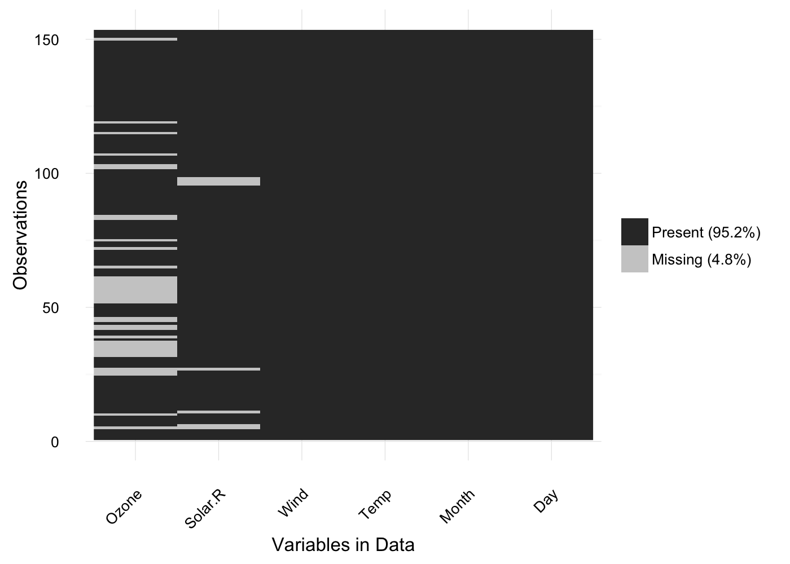
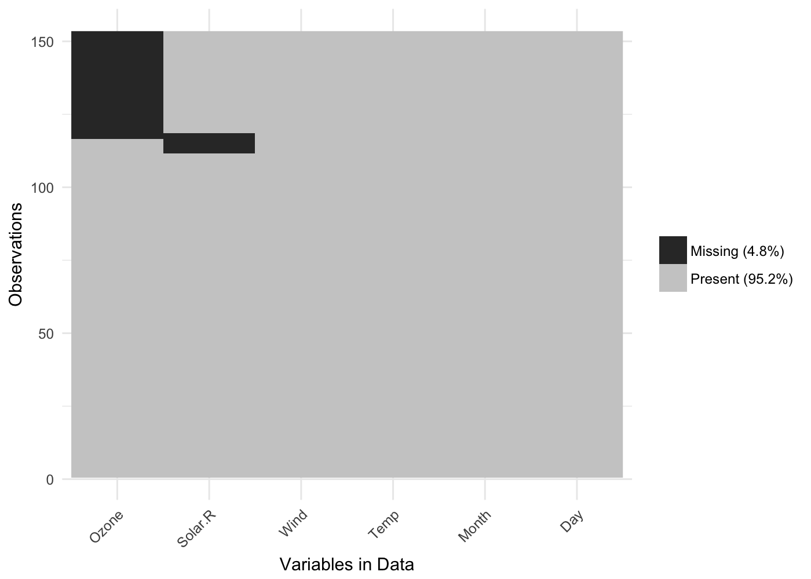
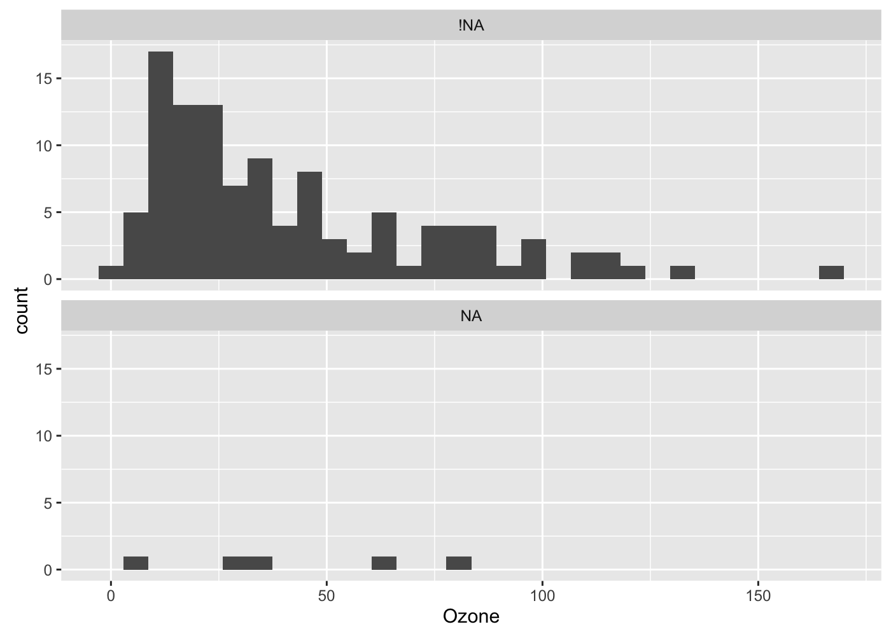
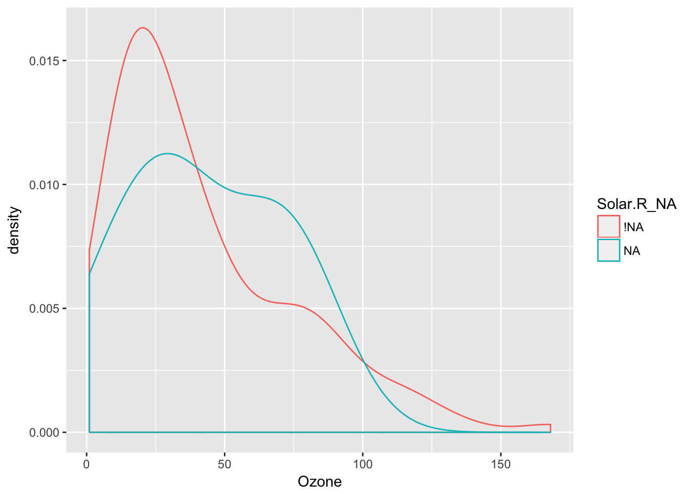
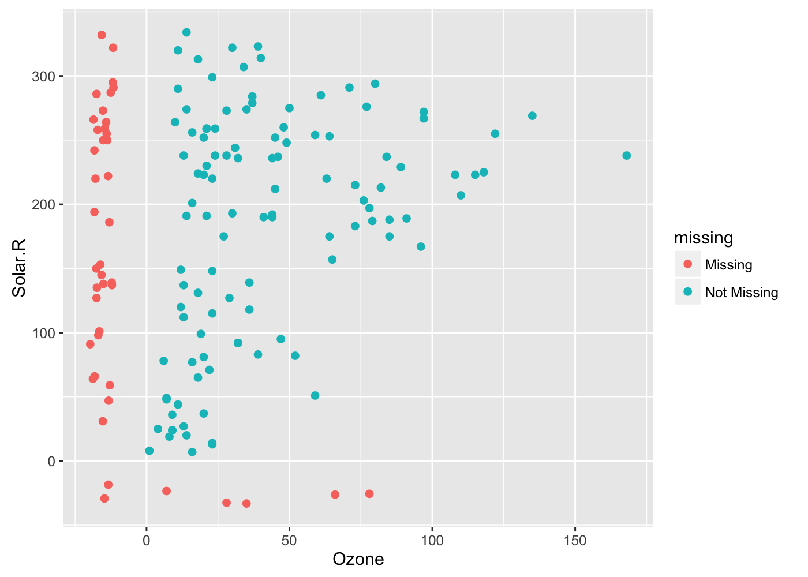
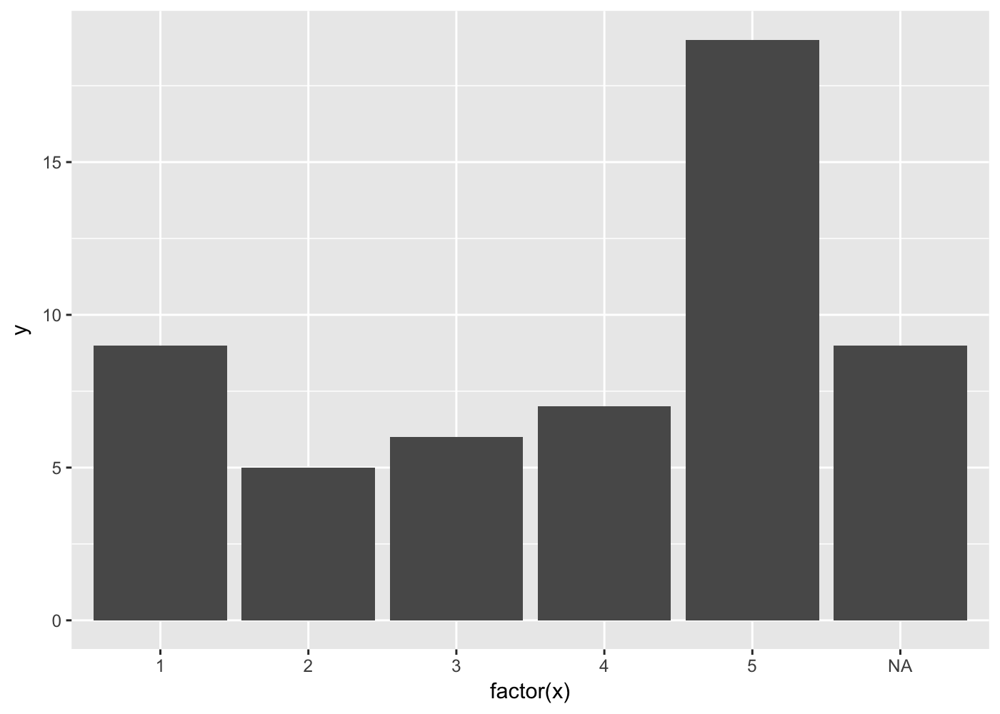
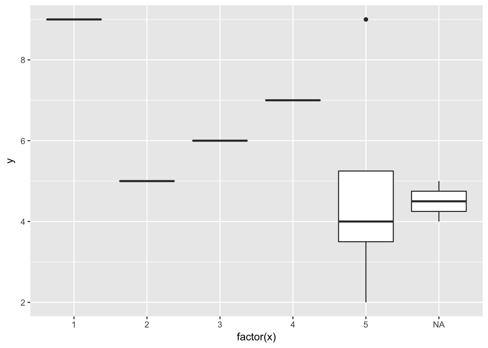

# naniar: Expanding ggplot2 for better visual exploration missingsness
Nicholas Tierney, Di Cook  
14/12/2016  


# Introduction

Missing data is ubiquitous in data analysis, and are often the source of much energy, frustration, and confusion. Existing approaches to exploring missing data structure either provide stand alone software, or build their own workflow. ggplot2, an implementation of the grammar of graphics for data visualisation is an incredibly popular way to produce exploratory and publication quality graphics, but it does not yet currently missing data. Tidy data, another philosophy of Wickham makes it easy and consistent to engage in data manipulation and wrangling. This paper describes approaches for exploring missing data structure with minimal deviation from the common workflows of ggplot and tidy data structures.

Since 2014 there has been substantial development in the area of "tidy data" [ @wickham], which states the (surprisingly simple!) rule that each row is an observation and each column is a variable, which makes it easy to reason with data. This paper describes approaches for summarising missing data in numerical and graphical forms whilst maintaining a tidy format.

# Types of missing data

Canonical sources of missing data are questionnaires. Data obtained from questionnaires are often subject to both unknown and known missingness structure. Unknown missing data structure may arise from respondents accidentally failing to answer questions or inadvertently providing inappropriate answers. Known missing data structure data may arise due to the structure of the questionnaire. For example, the first question on a survey might be: 'If YES, skip to question 4', resulting in questions 2 and 3 missing. If the structure of the questionnaire is known, this type of missingness can be evaluated easily. However, if this information is not available, the mechanism responsible for producing missing data must be inferred from the data.

Another common source of known and unknown structured missingness is medical examination data. Here the results of particular medical tests may be: missing for purely random reasons, missing due to the procedure, or missing based on decisions arising from the observed data. As an example, a young patient may not be subjected to neurodegenerative tests reserved for older workers. Longitudinal studies are also sources of missing data, where participants may not return for future testing sessions. In these cases it is difficult, sometimes impossible, to ascertain the reason for the dropouts, and hence, whether the missingness structure is known or unknown.

Imputation is the process of replacing the missing values with more likely values. However in order for estimates to be unbiased, it is essential to understand the missingness structure and mechanisms  [@Simon1986; @Little1988; @Rubin1976].

Other categories of missing data are sometimes identified: Missing Completeley at Random (MCAR), Missing At Random (MAR), and Missing Not At Random (MNAR) [ @Little2002]. MCAR describes where missingness has no association with the observed or unobserved data. MAR describes cases where missingness depends on data observed, but not data unobserved. MNAR is where the missingness of the response is related to an unobserved value relevant to the assessment of interest.

XXX How have you met missings before? What examples of data were you working with that had missing value problems?

## Existing packages for handling missing data

XXX Describe exisiting packages, and group them into what they do

Software focussing on missing data typically focus on imputation or visualisation. Packages such as mice, Hmisc, mi, Amelia, and mitools provide functions to facilitate imputation, and use a wide range of methods, from the simple mean or median imputation, to using regression or machine learning methods, right through to multiple imputation using EM, Bayesian methodologies, or user-written imputation procedures [@mice; @Hmisc; etc. ]. These packages also provide approaches for aggregating imputations, and performing diagnostics. These packages provide a wide variety of different imputation methods, with more work from new packages such as `simputation` [@simputation] using the pipe `%>%` operator with imputation procedures and working with the `dplyr` data manipulation. It is again important to remember that care must be taken to avoid bias when performing multiple imputation.

Missing data visualisation packages include the R package VIM, and the stand alone softwares MANET, ggobi, and MissingDataGUI [@Manet; @ggobi ; @MissingDataGui]. 

VIM (Visualising and Imputing Missing Data) provides methods for both imputation and visualisation of missing data. VIM provides visualisation methods that distinguish between observed, imputed, and missing values. Many visualisation methods are provided but notable are visualisations of imputed and observed values, and bivariate margin plots that display missing and imputed values together with observed values. VIM also has an interesting method for visualising imputed values, where it uses a specific delimiter to name variables imputed, so if Var1 has values imputed, another column is created that describes the location of imputed values of Var1, Var1_imp. This idea is discussed futher in missing data structures.

MANET (Missings Are Now Equally Treated), provides univariate visualisations of missing data using linked brushing between a reference plot of the missingness for each variable, and a plot of the data as a histogram or barplot. The plots of the data were highlighted when values of one variable were in the same row as a missing value. 

*some sort of figure describing this?*

ggobi provides multivariate visualisation of missing data using a reference plot of two variables cross tabulated by missingness, and parallel co-ordinate plots. A user could then select individual data points as missing/not for each varaible, which then linked to a parallel coordinate plot so that whichever values from the reference plot were then highlighted on the parallel coordinate plot. ggobi also provided incoporated missingness into scatterplots, here missing values from one variable are displayed as 10% below the minimum value on the other axis. This can be seen in figure 1 below.

MissingDataGUI provides a user interface for exploring missing data structure both numerically and visually, and visualisation methods imputated values. A limitation of MissingDataGUI is that it breaks workflow by being a separate part of analysis, where one might be performing an analysis using R, using a GUI to explore missing data may provide some valuable insights into important structures, but it can then be hard to incorporate these unscripted insights into analysis scripts.

XXX One paragraph on how ggplot2 handles missing values (or not): a message is printed and then the missings are ignored

ggplot2, an implementation of Lee Wilkenson's grammer of graphics in R (very popular), currently only provides visualisation of missing values for categories when there is a category variable, this provides visualisations for missing data when the values being plotted are categories, it treats one of the categories as a NA value. For all other plots, ggplot2 prints a warning message notifying the user how many missing values have been ommited form the plot.

We see that there are many ways to explore missing data structure and imputation, however in each of these there is ...

# Data structures for missing data


```r
# create a simple example of missing data for the paper to illustrate the shadow matrix
df_example <-  tibble::tribble(~V1, ~V2, ~V3, ~V4,
                               "A", 15, 1.2, NA,
                               "A", NA, NA, T,
                               "A", 18, NA, F,
                               "B", 5, 1.6, T,
                               "B", NA, 0.7, T,
                               "B", 12, NA, F)
```


Representing missing data structure is achieed using the shadow matrix, introduced in Swayne and Buja [-@Swayne1998]. The shadow matrix is the same dimension as the data, and consists of binary indicators of "missingness" of data values. In our case, missing is represented as "NA", and not missing is represented as "!NA", although these may be represented as 1 and 0, respectively. This can be seen in figure 1 below. This structure can also be extended to allow for additional factor levels to be created, where 0 indicates presence, 1 indicates missing, 2 might indicate an imputed value, or 3 might indicate a particular type or class of missingness - perhaps missing due to a particular reason.


__Figure 1., Plot of the  .__

The shadow matrix is represented in figure 1 going from Data to Shadow to show the existing datastructure, adding the suffix "_NA" to the variables. The data matrix can be augmented to include the shadow matrix, which facilitates visualisation of univariate and bivariate missing data visualisations. Another format is to display it in long form, which facilitates heatmap type visualisations of missing data.

## Usage

## Visualisation of missing data

**Heatmap**

One common method for visualising missing data is to display a heatmap of the shadow matrix. This approach can be very helpful for giving an overview of which variables contain the most missingness. Methods can also be applied to rearrange rows and columns to find clusters, and identify other interesting features of the data that may have previously been hidden or unclear. This method is shown below using the `vis_miss` from the `visdat` package.


```r
library(visdat)
vis_miss(airquality)
```

<!-- -->

```r
vis_miss(airquality, cluster = TRUE)
```

<!-- -->

Similar approaches has been used in other missing data packages such as VIM, mi, Amelia, and MissingDataGUI. However this plot provides the additional benefits of being in the ggplot framework, which gives users greater control over the plot appearance, and alter and update the figure as they need. The user can also apply clustering of the rows and columns using the `cluster = TRUE` argument.

To produce this plot, the data is required to be in long form.

**Facetted plots**

An advantage of the wide shadow format is that it allows for referring to missingness of other variables along the values of another variable. For example:


```r
ggplot(data = bind_shadow(airquality),
       aes(x = Ozone)) + 
  geom_histogram() + 
  facet_wrap(~Solar.R_NA,
             ncol = 1)
```

```
## `stat_bin()` using `bins = 30`. Pick better value with `binwidth`.
```

```
## Warning: Removed 37 rows containing non-finite values (stat_bin).
```

<!-- -->

```r
ggplot(data = bind_shadow(airquality),
       aes(x = Ozone,
           colour = Solar.R_NA)) + 
  geom_density()
```

```
## Warning: Removed 37 rows containing non-finite values (stat_density).
```

<!-- -->

This plot shows a histogram of Ozone, showing what the distribution of Ozone is when Solar.R is missing. 

Using this data structure facilitates missing data visualisation with ggplot as it means that the user can directly refer to the variable that they want to explore missingness. In the case above, the user is looking at a histogram of Ozone, but is then able to look at how many Ozone values are affected by Solar.R. In cases where there is no missing data in the variable that they want to "split" the missingness by, the plot simple returns a single facetted plot.

Another method of visualisation can be explored using `geom_missing_point()` from the ggmissing package:


```r
ggplot(data = airquality,
       aes(x = Ozone,
           y = Solar.R)) + 
  geom_missing_point()
```

<!-- -->

This utilises methods from ggobi, replacing missing values to be 10% below the minimum value. The missing values are also different colours, so that missingness becomes preattentive. An important feature 

## Numerical Summaries of missing data

Numerical summaries of missing data are also made easy with some helper functions from the `ggmissing` package. For example, finding the overall proportion of missing values in the data overall, or the cases, or variables, can be done with `percent_missing_*` functions.


```r
# Proportion elements in dataset that contains missing values
percent_missing_df(airquality)
```

```
## [1] 4.793028
```

```r
# Proportion of variables that contain any missing values
percent_missing_var(airquality)
```

```
## [1] 33.33333
```

```r
 # Proportion of cases that contain any missing values
percent_missing_case(airquality)
```

```
## [1] 27.45098
```

We can also look at the number and percent of missings in each case, and in each variable with `summary_missing_case`, and `summary_missing_var`.


```r
ggmissing::summary_missing_case(airquality)
```

```
## # A tibble: 153 × 3
##     case n_missing  percent
##    <int>     <int>    <dbl>
## 1      1         0  0.00000
## 2      2         0  0.00000
## 3      3         0  0.00000
## 4      4         0  0.00000
## 5      5         2 33.33333
## 6      6         1 16.66667
## 7      7         0  0.00000
## 8      8         0  0.00000
## 9      9         0  0.00000
## 10    10         1 16.66667
## # ... with 143 more rows
```

```r
ggmissing::summary_missing_var(airquality)
```

```
## # A tibble: 6 × 3
##   variable n_missing   percent
##      <chr>     <int>     <dbl>
## 1    Ozone        37 24.183007
## 2  Solar.R         7  4.575163
## 3     Wind         0  0.000000
## 4     Temp         0  0.000000
## 5    Month         0  0.000000
## 6      Day         0  0.000000
```

We can also present tabulations that present more complicated inferences with `table_missing_case` and `table_missing_var`. These tally up the number of missings in each case or variable, then describe how many cases or variables have that many missings, and the percentage of cases or variables that contain missings


```r
ggmissing::table_missing_case(airquality)
```

```
## # A tibble: 3 × 3
##   n_missing_in_case n_cases  percent
##               <int>   <int>    <dbl>
## 1                 0     111 72.54902
## 2                 1      40 26.14379
## 3                 2       2  1.30719
```

```r
ggmissing::table_missing_var(airquality)
```

```
## # A tibble: 3 × 3
##   n_missing_in_var n_vars  percent
##              <int>  <int>    <dbl>
## 1                0      4 66.66667
## 2                7      1 16.66667
## 3               37      1 16.66667
```

<!-- it would be really cool if we could implement dplyr `group_by` syntax for the data, to produce summaries of missingness for 1993 and 1997 respectively. -->

# Discussion

We describe the current packages and software for exploring and visualising missing data.


This is the `bind_shadow` versus computing on the fly with `is_na`

```

ggplot(data = bind_shadow(airquality),
       aes(x = Ozone)) + 
  geom_histogram() + 
  facet_wrap(Solar.R_NA),
             ncol = 1)
             
ggplot(data = airquality,
       aes(x = Ozone)) + 
  geom_histogram() + 
  facet_wrap(is_na(Solar.R),
             ncol = 1)

```

It is important to consider then the implications for storage, when using bind_shadow, and computation, when using the `is_na` approach. `bind_shadow` provides some flexibility and extensibility, as it allows for more complex types of missingness. For example, it could extending from missing, `NA`,and not missing, `!NA`, to extend to different mechanisms for missingness `NA_missing_for_reason_A`, `NA_missing_for_reason_B`, or imputed values `value_imputed`. 

**Limitations**

More research is needed to be done on how to visualise, store, and summarise imputations while staying in a tidy data framework. Multiple imputation could be stored using nested dataframes for each multiple imputation. We didn't discuss how to visualise imputations, but you can imagine a similar framework for labelling imputations in a data structure.


**Future work**

explore model-based approaches for exploring  based missing data structures.

- How does this expand the field?
- How is this different to previous findings / usage?

# to do

- Check write up of imputation / visualisation
- check vis writeup
- explain the figure of the shadow matrix
- Check the "usage" section.

# Appendix 

## ggplot's current approach to missing data


```r
data_test <- data_frame(x = c(1,2,3,4,5,5,5,5,NA,NA),
                        y = c(9,5,6,7,4,9,2,4,4,5))

data_test
```

```
## # A tibble: 10 × 2
##        x     y
##    <dbl> <dbl>
## 1      1     9
## 2      2     5
## 3      3     6
## 4      4     7
## 5      5     4
## 6      5     9
## 7      5     2
## 8      5     4
## 9     NA     4
## 10    NA     5
```

```r
  ggplot(data_test,
         aes(x = factor(x),
             y = y)) + 
  geom_bar(stat = "identity")
```

<!-- -->

```r
  ggplot(data_test,
         aes(x = factor(x),
             y = y)) + 
  geom_boxplot()
```

<!-- -->


## Shadow Matrix Examples

Example of the shadow matrix


V1_NA   V2_NA   V3_NA   V4_NA 
------  ------  ------  ------
!NA     !NA     !NA     NA    
!NA     NA      NA      !NA   
!NA     !NA     NA      !NA   
!NA     !NA     !NA     !NA   
!NA     NA      !NA     !NA   
!NA     !NA     NA      !NA   

Example of the augmented shadow matrix:


```r
knitr::kable(bind_shadow(df_example))
```


V1    V2    V3  V4      V1_NA   V2_NA   V3_NA   V4_NA 
---  ---  ----  ------  ------  ------  ------  ------
A     15   1.2  NA      !NA     !NA     !NA     NA    
A     NA    NA  TRUE    !NA     NA      NA      !NA   
A     18    NA  FALSE   !NA     !NA     NA      !NA   
B      5   1.6  TRUE    !NA     !NA     !NA     !NA   
B     NA   0.7  TRUE    !NA     NA      !NA     !NA   
B     12    NA  FALSE   !NA     !NA     NA      !NA   

Example of the gathered shadow matrix:


```r
as_shadow(df_example) %>%
  mutate(rows = 1:nrow(.)) %>%
  gather(key = "var",
         value = "miss",
         -rows) %>%
  slice(1:10) %>%
  knitr::kable()
```


 rows  var     miss 
-----  ------  -----
    1  V1_NA   !NA  
    2  V1_NA   !NA  
    3  V1_NA   !NA  
    4  V1_NA   !NA  
    5  V1_NA   !NA  
    6  V1_NA   !NA  
    1  V2_NA   !NA  
    2  V2_NA   NA   
    3  V2_NA   !NA  
    4  V2_NA   !NA  

# References
